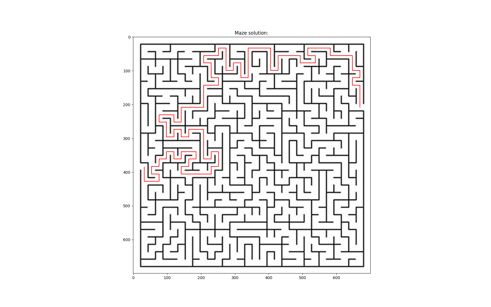
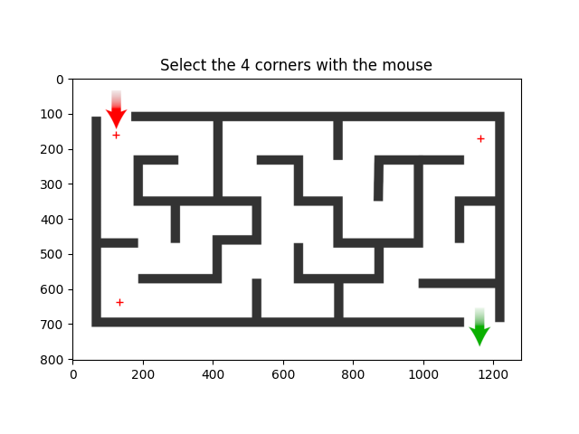
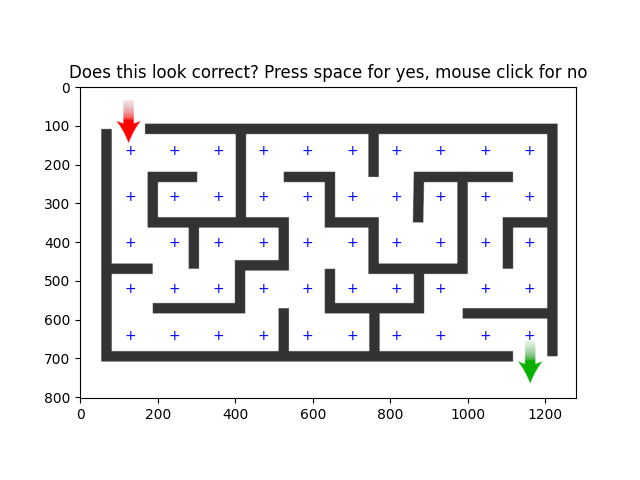
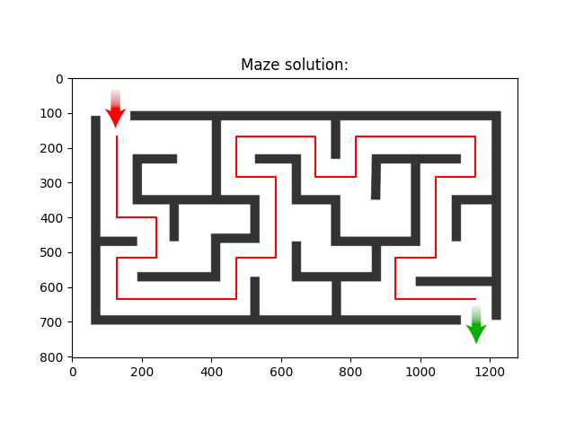

# Python Maze Solver

Mazesolve is a maze solving program that takes an image of a maze, collects information about the maze such as the corners,
start, and finish of the maze from the user, and uses the Depth First Search (DFS) algorithm to find a path from
start to finish. After a valid solution is found, mazesolve marks the correct path on the maze and displays it to the
user.



### Installation and Usage

1. Install `mazesolve` using pip
    ```bash
    pip install git+https://github.com/djcopley/mazesolve.git@main
    ```
2. Run `mazesolve`
    ```bash
    mazesolve
    ```
3. Follow the program prompts
    
    
4. Visualize the results
   

### Caveats

- The maze image should be in RGB png or jpg format. Mazesolve is not designed to handle transparency (i.e. an alpha
channel) so images in the format RGBA might not work.

